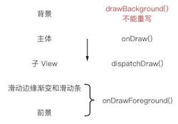
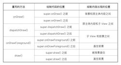

# 概述

- onDraw()
- dispatchDraw()
- 绘制过程
- onDrawForeground()
- draw()
- 注意事项
- 总结

## onDraw

> super.onDraw() 前 or 后？

1. 如果继承 `View` ，
则 `绘制代码` 写在 `前面和后面` 都无所谓，因为 `View.onDraw` 是 空实现。

2. 如果是继承 已有控件，则需要考虑 `绘制顺序` 了

- 写在 `super.onDraw()` 的下面: 绘制内容就会盖住控件原来的内容。

- 写在 `super.onDraw()` 的上面: 绘制的内容会被控件的原内容盖住。

## dispatchDraw

> 用于 `绘制子 View`，一般只对 `ViewGroup` 起作用。

- 写在 super.dispatchDraw() 的下面： `绘制` 发生在 `子View 的绘制之后`，从而让绘制内容盖住子 View 了。
- 写在 super.dispatchDraw() 的上面： 绘制就在 `onDraw() 之后`、 `super.dispatchDraw() 之前`发生，`子view` 会覆盖 `绘制内容`。

## 绘制过程

一个完整的绘制过程一般包括如下几个方面：

- 背景(drawBackground())
- 主体（onDraw()）
- 子 View（dispatchDraw()）
- 滑动边缘渐变和滑动条
- 前景

> 前景的支持是在 `Android 6.0（也就是 API 23` 才加入的；之前其实也有，不过只支持 FrameLayout，而直到 6.0 才把这个支持放进了 View 类里。

具体可以看下面这张图：



### 滑动边缘渐变和滑动条

- android:scrollbarXXX
- View.setXXXScrollbarXXX()

### 前景

- android:foreground
- View.setForeground()

## onDrawForeground()

> 通过 `顺序` 来控制 `绘制覆盖关系`
> `API 23` 才引入
> 会依次绘制 `滑动边缘渐变`、`滑动条` 和 `前景`.

- 写在 super.onDrawForeground() 的下面: 绘制内容将会盖住滑动边缘渐变、滑动条和前景
- 写在 super.onDrawForeground() 的上面:
绘制内容会盖住子 View，但被滑动边缘渐变、滑动条以及前景盖住,<Br/>
和 写在 super.dispatchDraw() 的下面的效果是一样的
- 滑动边缘渐变、滑动条和前景是 被一起写进了 onDrawForeground() 方法里的，没法在之间绘制内容

## draw()

```java
// View.java 的 draw() 方法的简化版大致结构（是大致结构，不是源码哦）：

public void draw(Canvas canvas) {
    ...

    drawBackground(Canvas); // 绘制背景（不能重写）
    onDraw(Canvas); // 绘制主体
    dispatchDraw(Canvas); // 绘制子 View
    onDrawForeground(Canvas); // 绘制滑动相关和前景

    ...
}
```

> `后面绘制的内容` 会覆盖 `前面的内容`。


### 写在 super.draw() 的下面

>  和 重写 `onDrawForeground()`，并将 绘制 写在 `super.onDrawForeground()` 之后效果一致。

### 写在 super.draw() 的上面

> 会在其他所有绘制之前被执行,绘制内容会被其他所有的内容盖住.

> 使用场景，就是 给 `EditText` 绘制背景。

## 注意事项

1. 在 ViewGroup 的子类中重写除 dispatchDraw() 以外的绘制方法时，可能需要调用 setWillNotDraw(false)；
2. 在重写的方法有多个选择时，优先选择 onDraw()。

## 总结



相关练习：https://github.com/BoBoMEe/PracticeDraw5


