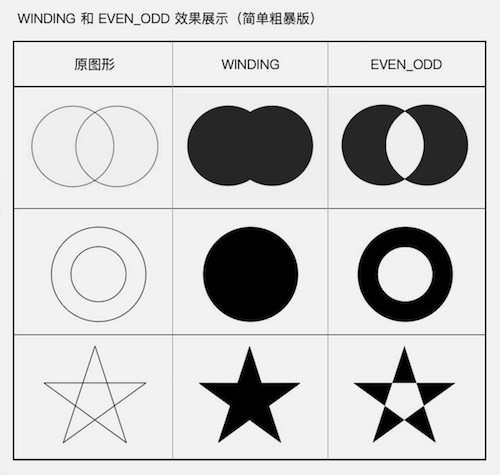

# 自定义绘制概述

1. 重写绘制方法 onDraw()
2. Canvas的使用
- Canvas绘制类方法，drawXX()，这里涉及到关键参数 Paint 的操作
- Canvas辅助类方法,范围裁切和几何变换
3. 使用不同的绘制方法来控制遮盖关系

# 自定义绘制的四个级别

1. Canvas 的 `drawXXX()` 及 `Paint 使用`
2. Paint 的完全攻略，挖掘 更多的 `Paint使用技巧` 及 `风格设置`
3. Canvas 绘制辅助,范围裁切和几何变换，用于实现 `很炫酷的效果`
4. 控制绘制顺序，提高UI性能（多层 View 才能拼凑出来效果，一个 View 搞定）

# onDraw()： 一切的开始

```java
Paint paint = new Paint();

@Override
protected void onDraw(Canvas canvas) {
    super.onDraw(canvas);

    // 绘制一个圆
    canvas.drawCircle(300, 300, 200, paint);
}
```

主要涉及 Canvas 和 Paint 的 相关操作。

## Canvas

Canvas：draw- 打头的方法，

- drawColor(@ColorInt int color)/drawRGB(int r, int g, int b):绘制之前设置底色,或者在绘制之后为界面设置半透明蒙版
- drawCircle
- drawRect
- drawPoint
- drawPoints
- drawOval
- drawLine
- drawLines
- drawRoundRect
- drawArc
- drawPath


## Paint常用方法

- Paint.setStyle(Style style) 设置绘制模式，空心或实心
- Paint.setColor(int color) 设置颜色
- Paint.setStrokeWidth(float width) 设置线条宽度
- Paint.setTextSize(float textSize) 设置文字大小
- Paint.setAntiAlias(boolean aa) 设置抗锯齿开关

绘制方法中的 `独有信息` 都是作为参数传递到 `draw-`方法中的，
`公有信息`则是统一放在 `paint` 参数里的

## Path

用于绘制自定义图形，通过描述路径的方式来绘制图形。
两类作用：一类是直接描述路径，二类是辅助的设置或计算。

### 直接描述路径

这一类还可以细分为两组：添加子图形和画线（直线或曲线）

- addXxx();添加子图形

> canvas.drawCircle() == path.AddCircle(x, y, radius, dir) + canvas.drawPath(path, paint);

- xxxTo();画线（直线或曲线）

> lineTo(float x, float y): 绝对坐标

> rLineTo(float x, float y): 相对坐标

> quadTo/rQuadTo: 二次贝塞尔曲线

> cubicTo/rCubicTo: 三次贝塞尔曲线

> moveTo: 移动到目标位置

> arcTo()/addArc():比起Canvas.drawArc()，
少一个`useCenter`参数，只用来画弧形而不画扇形，所以不再需要
多了一个`forceMoveTo`参数，是要「抬一下笔移动过去」,还是「直接拖着笔过去」

> close():封闭当前子图形，Paint.Style == FILL | FILL_AND_STROKE 的时候，会自动封闭

### 辅助的设置或计算

使用场景比较少，这里只讲了其中一个方法：

- Path.setFillType(Path.FillType ft)：设置填充方式

包含四个值：填入不同的 FillType 值，就会有不同的填充效果

- EVEN_ODD
- WINDING （默认值）
- INVERSE_EVEN_ODD
- INVERSE_WINDING

使用图例:



文章练习：https://github.com/BoBoMEe/PracticeDraw1


