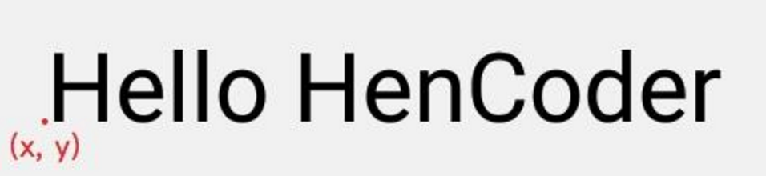

# Canvas 绘制文字的方式

- drawText
- drawTextRun
- drawTextOnPath

## drawText

这里需要注意的是 绘制文字的坐标 并不是文字的左上角，而是如下所示。

其中 y 是baseline， 而 x 是包含了文字左边留出的空隙。

## drawTextRun

几乎用不到。

## drawTextOnPath

沿着一条 Path 来绘制文字。

> 需要注意：rawTextOnPath() 使用的 Path ，拐弯处全用圆角，别用尖角。

## StaticLayout

Canvas.drawText() 只能绘制单行的文字，而不能换行。

- 长文本在绘制边缘没有换行
- 不能在 \n 处换行

解决办法： 使用StaticLayout来绘制。

# Paint

Paint 对文字绘制的辅助，有两类方法：设置显示效果，测量文字尺寸。

## 设置显示效果

- setTextSize 设置文字大小
- setTypeface 设置字体
- setFakeBoldText 是否使用伪粗体
- setStrikeThruText 是否加删除线
- setUnderlineText 是否加下划线
- setTextSkewX 设置文字横向错切角度
- setTextScaleX 设置文字横向放缩
- setLetterSpacing 设置字符间距。默认值是 0
- setFontFeatureSettings 用 CSS 的 font-feature-settings 的方式来设置文字
- setTextAlign 设置文字的对齐方式
- setTextLocale 设置绘制所使用的 Locale
- setHinting 设置是否启用字体的 hinting
- setSubpixelText 是否开启次像素级的抗锯齿

## 测量文字尺寸类

- getFontSpacing 获取推荐的行距
- getFontMetrics 获取 Paint 的 FontMetrics，
其中包含几个文字排版方面的属性值：ascent, descent, top, bottom, leading。
- getTextBounds 获取文字的显示范围
- measureText 测量文字的宽度并返回，比 getTextBounds 大（ 和 上面 y 的值是一个原因 ）
- getTextWidths(String text, float[] widths) 获取字符串中每个字符的宽度，并把结果填入参数 widths。
和分别调用 measureText 类似
- breakText 用来测量文字宽度的，和 measureText() 的区别是breakText() 是在给出宽度上限的前提下测量文字的宽度。如果文字的宽度超出了上限，那么在临近超限的位置截断文字
- 光标相关
> 1. getRunAdvance 对于一段文字，计算出某个字符处光标的 x 坐标
> 2. getOffsetForAdvance 给出一个位置的像素值，计算出文字中最接近这个位置的字符偏移量（即第几个字符最接近这个坐标）
- hasGlyph 检查指定的字符串中是否是一个单独的字形

练习项目：https://github.com/BoBoMEe/PracticeDraw3

